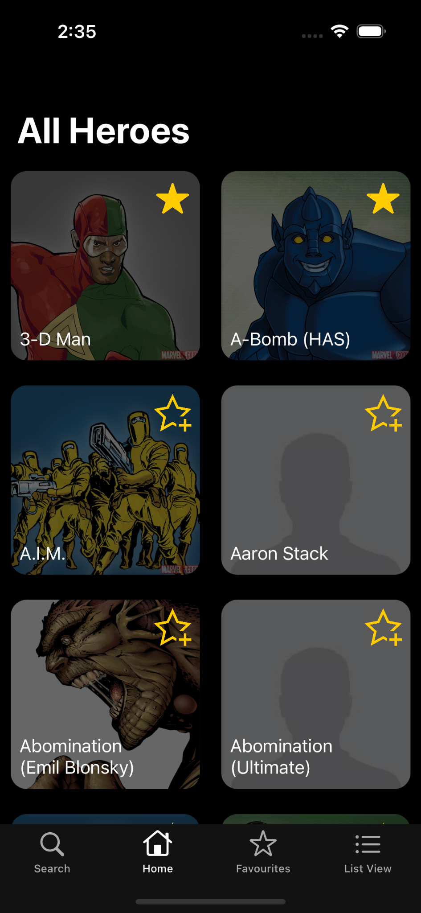
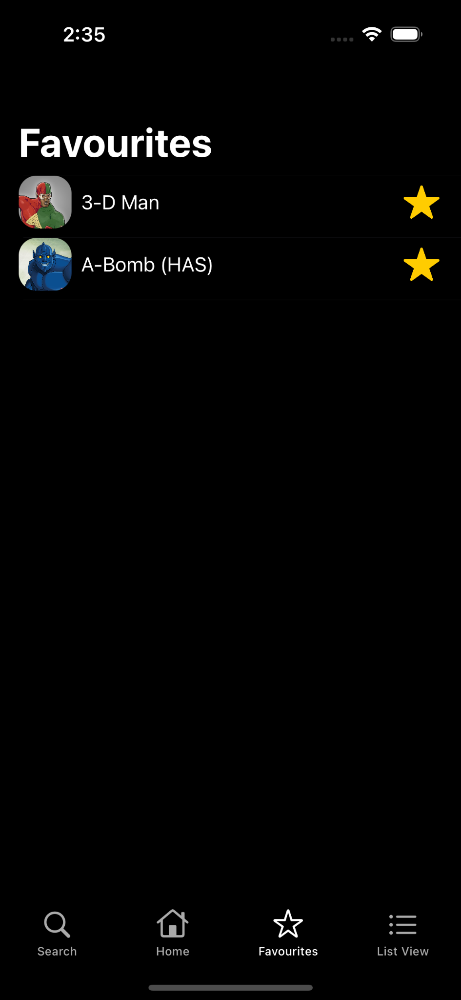
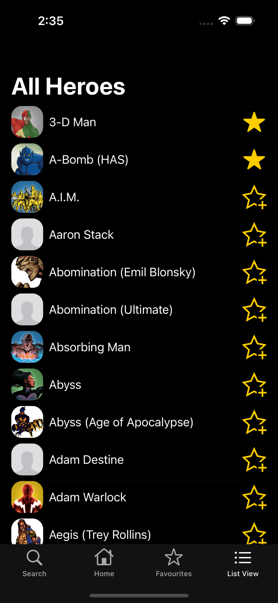
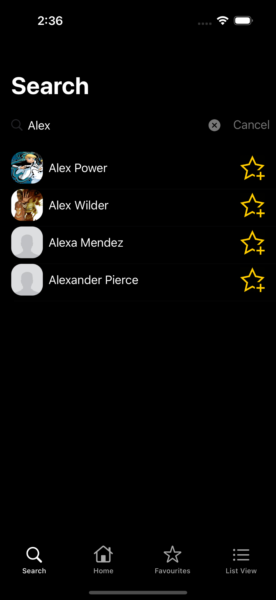
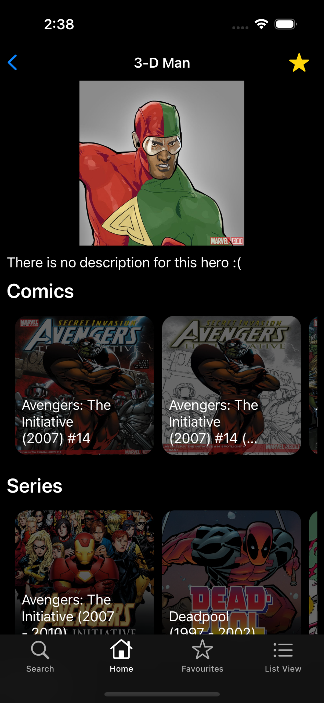
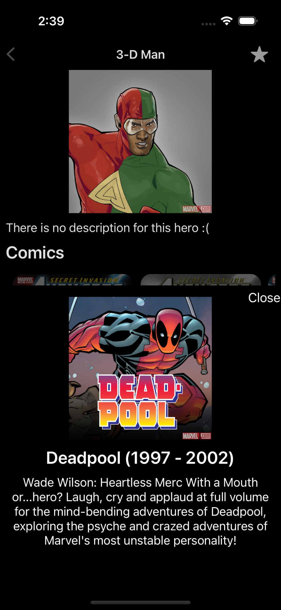

# Heroes Application

https://github.com/bvlourenco/heroes-ios/assets/47830533/4d9b4b89-0b75-4572-834e-dd051ce6b346

## Description

This is a small iOS application used to learn more about Swift and UIKit.

It fetches heroes from [Marvel API](https://developer.marvel.com/) and displays them on the screen. 

It also allows searching for heroes by name, favouriting heroes and displaying them more in detail, by showing the comics, series, events and stories associated to them.

## Screenshots

    
     
    
    
    
    

## Features
- Displays all heroes in two ways: in a List (using a TableView) or in a Grid (using a CollectionView)
- Infinite loading of heroes: 20 heroes are loaded at once and when we reach the last 10 heroes, more heroes are fetched from the API
- Displays each hero in more detail, with its name, image, description, comics, series, events and stories
  - For each comic/series/event/story, we display its name, description and image
- Using placeholder image stored locally to avoid loading images coming from the API that are broken (saving network data)
- Using a task group to load at the same time the descriptions of comics/series/events/stories
  - Loading descriptions in parallel
  - The remaining data is fetched when fetching all heroes
- Using an Image Loader to only load each image from web once
- Can favourite each hero and persist the favorite heroes among different sessions (using UserDefaults)
- Can search for a hero by its name

## Acknowledgements
I would like to thank my mentor Nuno Castro for all the help he gave to me. 
Furthermore, I would also like to thank the Indigo team for helping me.
